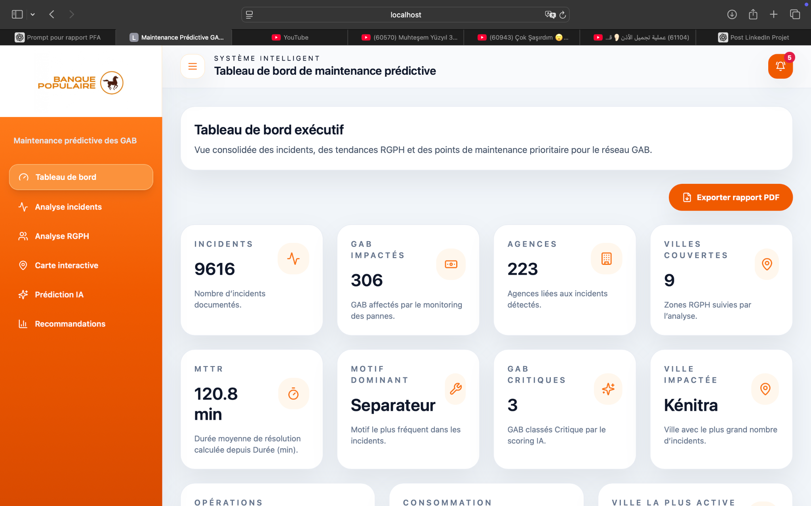
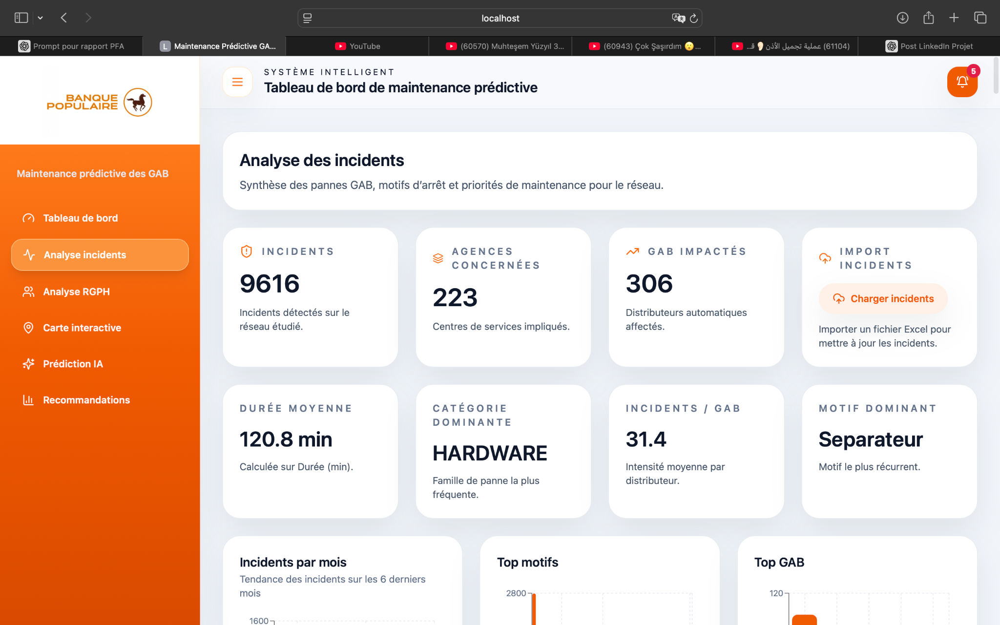
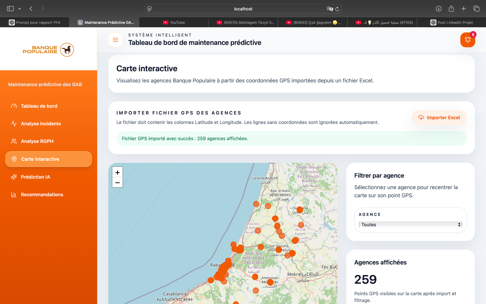
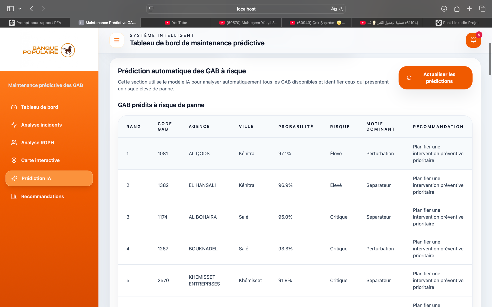
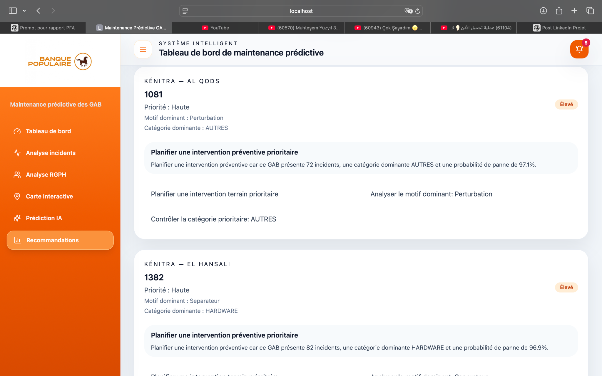

# 🚀 ATM Predictive Maintenance Platform

> An AI-powered predictive maintenance platform for ATM networks developed during my engineering internship at **Banque Centrale Populaire**.

This project combines **Machine Learning**, **Data Engineering**, **Geospatial Analytics**, and **Full-Stack Development** to predict ATM failures, monitor network health, and support maintenance teams through an interactive decision-support platform.

---

## 📌 Project Highlights

- 🤖 AI-powered ATM failure prediction
- 📊 Interactive executive dashboard
- 🗺️ Geospatial visualization with interactive maps
- 📈 Machine Learning-based risk scoring
- 🧠 Intelligent maintenance recommendations
- 📄 PDF report generation
- 📥 Excel data import
- ⚡ RESTful API built with FastAPI
- 🐳 Dockerized deployment

---

## 📊 Project Overview

During my engineering internship at **Banque Centrale Populaire**, I developed a complete predictive maintenance platform to help monitor ATM networks and identify machines that are likely to fail before breakdowns occur.

The system analyzes operational incident history together with demographic and geographical information to provide actionable insights for maintenance teams. Beyond machine learning, the project focuses on building a complete production-style application, from data processing to visualization and recommendation generation.

---

## 🏆 Key Results

- **9,616** ATM incidents analyzed
- **223** agencies monitored
- **306** ATMs covered
- Interactive analytics dashboards
- AI-based risk prediction engine
- Automated maintenance recommendations
- Geographic visualization of ATM locations
- Executive reporting with PDF export

---

# 📸 Application Preview

## Executive Dashboard

> Overview of network performance, KPIs and operational indicators.




---

## Incident Analytics

> Analyze incidents by category, city, agency and time.




---

## Interactive Map

> Visualize ATM locations and filter agencies geographically.



---

## AI Prediction Engine

> Predict high-risk ATMs using Machine Learning.



---

## Recommendation Engine

> Generate maintenance recommendations for critical ATMs.



---

# 🏗️ System Architecture

```text
Excel Incident Files
           │
           ▼
     Data Cleaning
           │
           ▼
   Feature Engineering
           │
           ▼
     Machine Learning
       (XGBoost)
           │
           ▼
       FastAPI API
           │
           ▼
 React + TypeScript Dashboard
           │
           ▼
 Interactive Visualizations
```

---

# ⚙️ Tech Stack

## Frontend

- React
- TypeScript
- Vite
- Tailwind CSS
- React Router
- Recharts
- React Leaflet
- Lucide Icons

## Backend

- Python
- FastAPI
- Pandas
- Scikit-learn
- XGBoost
- SQLAlchemy
- SQLite

## DevOps

- Docker
- Docker Compose
- Git
- GitHub

---

# ✨ Main Features

### Executive Dashboard

- Network KPIs
- Operational statistics
- Performance indicators

### Incident Analytics

- Incident trends
- Category distribution
- Agency ranking
- Filtering by city and ATM

### Interactive Map

- ATM geolocation
- Agency filtering
- GPS visualization

### AI Prediction

- Predict ATM failures
- Risk scoring
- Probability estimation
- Critical ATM ranking

### Recommendation Engine

- Automated maintenance recommendations
- Priority-based intervention planning
- Decision support

### Reporting

- PDF export
- Operational summaries

---

# 📂 Project Structure

```text
maintenance-predictive-gab/
│
├── frontend/
│   ├── src/
│   ├── public/
│   └── package.json
│
├── backend/
│   ├── app/
│   ├── models/
│   ├── api/
│   └── requirements.txt
│
├── docker-compose.yml
├── README.md
└── .gitignore
```

---

# 🚀 Installation

## Clone the repository

```bash
git clone https://github.com/salma-abarkane/maintenance-predictive-gab.git
```

---

## Frontend

```bash
cd frontend
npm install
npm run dev
```

---

## Backend

```bash
cd backend

python -m venv venv

# Windows
venv\Scripts\activate

# Linux / macOS
source venv/bin/activate

pip install -r requirements.txt

uvicorn app.main:app --reload --port 8000
```

---

# 🐳 Docker

```bash
docker compose up --build
```

---

# 🌐 Application URLs

Frontend

```
http://localhost:4173
```

Backend

```
http://localhost:8000
```

---

# 🔗 API Endpoints

| Method | Endpoint | Description |
|---------|----------|-------------|
| GET | `/api/summary` | Executive dashboard |
| GET | `/api/incidents` | Incident analytics |
| GET | `/api/demographics` | Demographic data |
| GET | `/api/map` | Interactive map |
| GET | `/api/predictions` | AI predictions |
| GET | `/api/recommendations` | Maintenance recommendations |
| POST | `/api/predict` | Predict ATM failure |

---

# 📈 Future Improvements

- PostgreSQL integration
- Azure cloud deployment
- CI/CD pipeline
- Authentication & role management
- Real-time monitoring
- Kafka streaming
- Automated model retraining

---

# 👩‍💻 Author

**Salma Abarkane**

Big Data & Artificial Intelligence Engineering Student

📍 Rabat, Morocco

- 🔗 [LinkedIn](https://linkedin.com/in/salma-abarkane)
- 💻 [GitHub](https://github.com/salma-abarkane)

---

# 📄 License

This project was developed as an academic engineering internship project for **Banque Centrale Populaire**.
